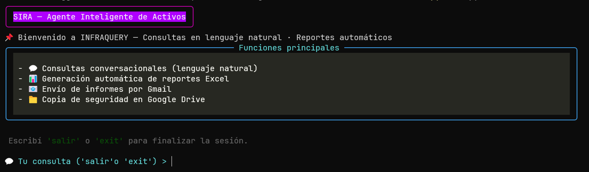

<div align="center">

  <h1>🤖 InfraQuery</h1>
  <h3>Gestión Inteligente de Activos de Infraestructura con IA</h3>

  <p>
    <b>Orquestado por SIRA (Sistema Inteligente de Reportes Automatizados)</b>
    <br>
    <i>Olvídate del SQL. Gestiona tu infraestructura conversando.</i>
  </p>

  <p>
    
    
    
    
  </p>

  <br>

  <a href="https://youtu.be/el5TBkMsraw?si=bHLHujUZQkABrxKI">
    
  </a>
  <a href="https://leeward-bassoon-757.notion.site/Grupo-5-Gesti-n-de-Activos-de-Infraestructura-4af9d54df79e4b33842aa6d64f7d7298">
    
  </a>
</div>

---

## 📖 Sobre el Proyecto

**InfraQuery** es una solución "End-to-End" impulsada por Inteligencia Artificial y Automatización que revoluciona la forma en que los departamentos de TI gestionan sus activos. Permite consultar, gestionar y reportar sobre el inventario de infraestructura utilizando **lenguaje natural**, eliminando la necesidad de conocimientos avanzados en SQL o procesos manuales tediosos.

El corazón del sistema es **SIRA**, un agente inteligente amigable que interpreta tus necesidades y ejecuta tareas complejas en segundos.

### 🎯 El Problema
Los equipos de IT suelen enfrentarse a:
* ❌ Inventarios desactualizados o dispersos en múltiples Excel.
* ❌ Falta de trazabilidad en mantenimientos y licencias.
* ❌ Dependencia de expertos en bases de datos para reportes simples.
* ❌ Tiempos de respuesta lentos ante auditorías.

### ✅ La Solución InfraQuery
* **Lenguaje Natural:** Pídele lo que necesitas como si hablaras con un colega.
* **Datos en Tiempo Real:** Conexión directa a una base de datos PostgreSQL robusta.
* **Acciones Automáticas:** Generación de Excel, envío por Email y respaldo en Google Drive en un solo flujo.
* **Eficiencia:** Reduce tareas de horas a minutos.

---

## 🏗️ Arquitectura y Stack Tecnológico

El sistema utiliza una arquitectura desacoplada donde el cliente (Python) se comunica con el cerebro (n8n + IA) a través de Webhooks.

<div align="center">
  
</div>

### Tecnologías Clave:
* **🐍 Python (Cliente):** Interfaz de terminal ligera, escalable y multiplataforma. Se encarga de capturar el input del usuario y gestionar la recepción de archivos binarios (Excel) o respuestas de texto.
* **⚡ n8n (Orquestador):** El motor de automatización visual. Gestiona el flujo lógico, conecta los servicios y maneja los errores. Destaca por su robustez y bajo costo.
* **🧠 Google Gemini (IA):** El "cerebro" de SIRA. Convierte peticiones en lenguaje natural a consultas SQL seguras (Text-to-SQL) y da personalidad al asistente.
* **🐘 PostgreSQL @ Supabase:** Base de datos relacional estándar empresarial. Garantiza integridad, seguridad y alto rendimiento.

---

## ⚙️ Flujo de Trabajo (n8n Workflow)

Toda la magia sucede en un flujo complejo de **n8n** que integra Agentes de IA con herramientas tradicionales.

<div align="center">
  
</div>

1.  **Entrada y Normalización:** Recepción del mensaje vía Webhook y unificación de formatos.
2.  **Núcleo de IA (SIRA):**
    * Utiliza `Google Gemini Chat Model`.
    * Tiene acceso a herramientas (`Postgres_Tool`) para consultas rápidas.
    * Mantiene memoria de la conversación (`Window Buffer Memory`).
3.  **Enrutador Inteligente:** Un `JSON Parser` determina si la IA quiere "Conversar" (Chat) o "Ejecutar una Acción" (Comando).
4.  **Ejecución de Comandos:**
    * Generación de SQL dinámico.
    * Conversión de resultados a binario `.xlsx`.
5.  **Acciones Paralelas:**
    * 📤 **Email:** Envío del reporte adjunto vía Gmail.
    * ☁️ **Drive:** Carga automática a Google Drive.
    * ⬇️ **Download:** Retorno del archivo al cliente Python para descarga local.

---

## 🗄️ Modelo de Datos

El sistema se apoya en una base de datos relacional sólida diseñada para la integridad de los activos.

<div align="center">
  
</div>

### Tablas Principales:
* **Activos:** El núcleo del inventario (Hardware, Software).
* **Ciclo de Vida:** Tablas de `AsignacionEmpleado`, `InstalaciónActivo` y `Mantenimiento` para trazabilidad completa.
* **Organización:** `Empleado`, `Departamento`, `Puesto`.

> **🚀 Optimización:** SIRA utiliza Vistas SQL pre-construidas (ej: `vw_licencias_por_vencer`, `vw_equipos_poca_vida_util`) para facilitar consultas complejas y reducir el margen de error de la IA.

---

## 💬 Ejemplos de Uso

Interactuar con **SIRA** es tan simple como escribir en tu terminal:

### 1. Conversación y Consultas Rápidas
> **Usuario:** *"Hola Sira, ¿cuántos activos tenemos en total?"*
>
> **🤖 SIRA:** *"¡Hola! Actualmente tenemos registrados **142 activos** en la base de datos, clasificados entre Hardware y Licencias."*

### 2. Generación de Reportes y Automatización
> **Usuario:** *"Necesito una lista de todas las licencias que vencen este mes. Por favor envíala por correo a jefe@empresa.com y guárdala en el Drive."*
>
> **🤖 SIRA:** *"¡Entendido! He generado el reporte `licencias_vencimiento_oct.xlsx`.
> ✅ Enviado a jefe@empresa.com
> ✅ Guardado en Google Drive
> ¿Necesitas algo más?"*

---

## 🚀 Instalación y Ejecución (Cliente Python)
<div align="center">
  
</div>

1.  **Clonar el repositorio:**
    ```bash
    git clone https://github.com/lunilop/cliente-gestion-activos-de-infraestructura.git

    cd cliente-gestion-activos-de-infraestructura
    ```

2.  **Instalar dependencias:**
    ```bash
    pip install -r requirements.txt
    ```
    *(Librerías principales: `requests`, `pandas`, `python-dotenv`, `prettytable`, `colorama`)*

3.  **Configurar entorno:**
    Crea un archivo `.env` con las credenciales de tu webhook de n8n:
    ```env
    WEBHOOK_PRODUCTION=tu_url_del_webhook
    WEBHOOK_USER=tu_usuario
    WEBHOOK_PASS=tu_contraseña
    ```

4.  **Iniciar SIRA:**
    ```bash
    python main.py
    ```

---
